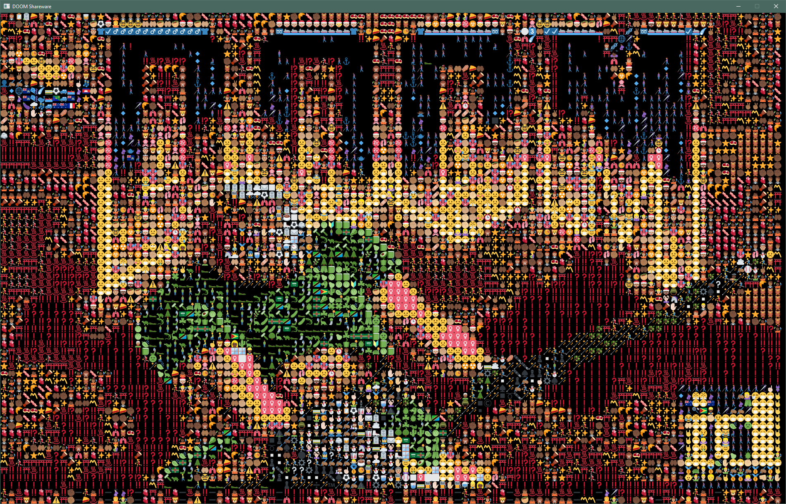

# DOOMoji

doom rendered with emojis. 

runs in SDL, so in theory can be built for any platform.

# Running

You'll need either a license of the original game or a shareware copy. Extract the files and make sure to copy your `DOOM1.WAD` in the same dictionary. Then run `doomoji.exe`.

# Credits

*DOOMoji* was only possible thanks to the amazing id Software for releasing the source code. Also, thanks to projects as [fbDOOM](https://github.com/maximevince/fbDOOM) and [doomgeneric](https://github.com/ozkl/doomgeneric), on which this project was based.

Follow me on Twitter: [CrociDB](https://twitter.com/CrociDB)
[bruno.croci.dev](https://bruno.croci.dev/)
